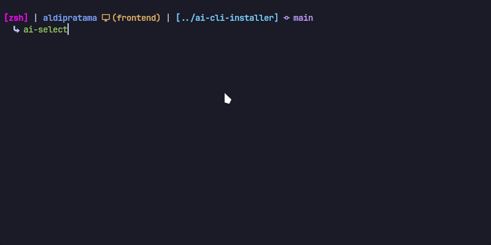
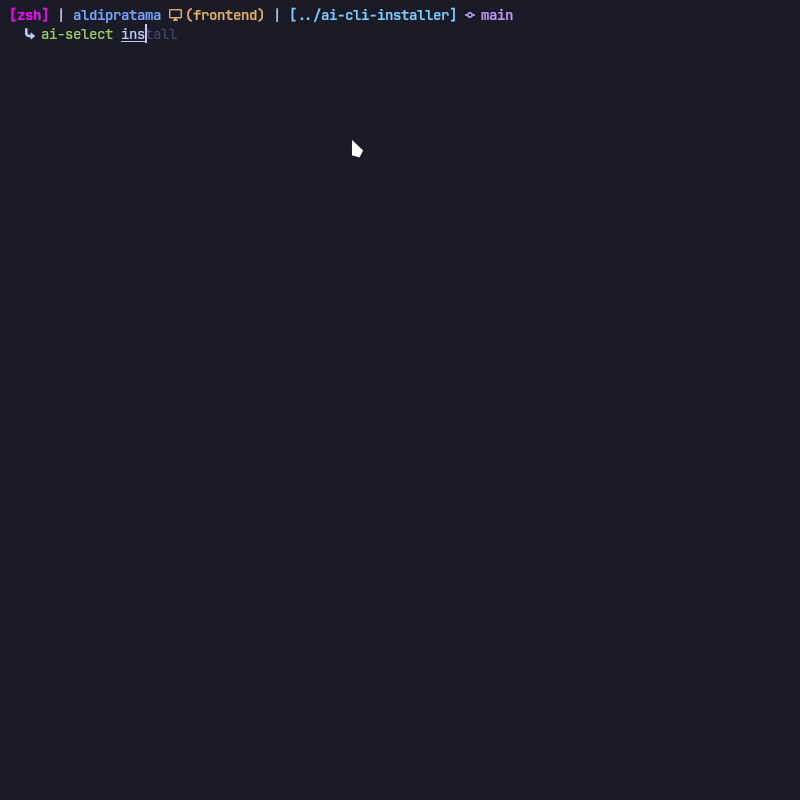
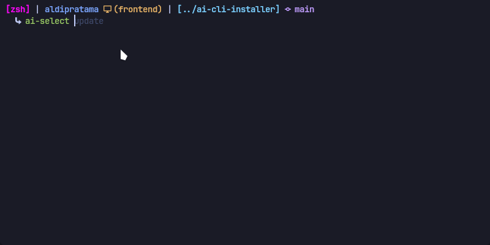

[Read in English](README.md)

# AI-CLI Selector & Installer

[](https://opensource.org/licenses/MIT)
[](https://www.shellcheck.net/)

Sebuah menu terpusat untuk **menjalankan** dan **menginstal** semua alat AI berbasis baris perintah (CLI) favorit Anda. Lupakan mengingat selusin perintah berbeda, cukup jalankan `ai-select`.



---

## ✨ Fitur Utama

- **Mode Launcher Cerdas:** Perintah `ai-select` secara otomatis mendeteksi alat AI yang sudah terinstal dan menampilkannya dalam menu untuk dieksekusi secara instan.
- **Mode Installer Andal:** Perintah `ai-select install` membuka antarmuka untuk menginstal alat AI baru, lengkap dengan logika fallback cerdas.
- **UI Interaktif Modern:** Ditenagai oleh `gum` untuk pengalaman pengguna yang mulus.
- **Dukungan Multi-Platform:** Bekerja di berbagai distribusi Linux dan macOS.
- **Mudah Diperluas:** Menambahkan AI-CLI baru ke dalam daftar sangat mudah, cukup dengan mengedit satu file konfigurasi.

## 🚀 Instalasi Cepat

Instal `ai-select` ke sistem Anda dengan satu perintah:

```bash
curl -fsSL https://raw.githubusercontent.com/aldiipratama/ai-cli-selector/main/install.sh | sh
```



Anda dapat menjalankan perintah ini dari direktori mana pun. Skrip akan secara otomatis menginstal file ke lokasi yang benar di direktori home Anda (`~/.local/share` dan `~/.local/bin`).

Skrip instalasi akan menempatkan perintah `ai-select` di `~/.local/bin`. Pastikan direktori ini ada di PATH Anda.

## 🎮 Penggunaan

Setelah terinstal, Anda dapat menggunakan `ai-select` dari direktori mana pun.

### Menjalankan Alat AI (Mode Launcher)

Cukup jalankan perintah tanpa argumen untuk membuka menu launcher. Menu ini hanya akan menampilkan alat AI yang sudah terinstal di sistem Anda.

```bash
ai-select
```

Pilih salah satu, dan skrip akan langsung menjalankannya.

### Menginstal Alat AI Baru (Mode Installer)

Untuk menambah, memperbarui, menghapus, atau menginstal ulang alat AI, gunakan argumen `install`.

```bash
ai-select install
```

Ini akan membuka menu instalasi lengkap yang memungkinkan Anda memilih alat dari daftar utama.

### Memperbarui Alat

Untuk memperbarui `ai-select` ke versi terbaru, termasuk daftar AI yang tersedia, jalankan:

```bash
ai-select update
```



Ini akan mengambil versi terbaru dari skrip dan konfigurasinya dari GitHub.

## 🔧 Menambah atau Memodifikasi AI-CLI

Semua konfigurasi alat AI disimpan di dalam file: `~/.local/share/ai-cli-selector/data/ai-metadata.conf`.

Untuk menambahkan AI baru, cukup tambahkan "blok" baru di akhir file tersebut. Formatnya adalah sebagai berikut:

```ini
[NAMA_AI]
name=Nama Tampilan
command=perintah_cli
description=Deskripsi singkat
preferred_source=metode_instalasi_utama
alt_sources=pip|aur
test_command=perintah_cli --version
...
```

## 🤝 Berkontribusi

Kontribusi, isu, dan permintaan fitur sangat saya harapkan! Jangan ragu untuk membuka [isu](https://github.com/aldiipratama/ai-cli-selector/issues) baru.

## 📜 Lisensi

Proyek ini dilisensikan di bawah **MIT License**. Lihat file `LICENSE` untuk detailnya.

## ❤️ Kredit

Proyek ini dibuat dan dipelihara dengan sepenuh hati oleh:

- **[aldiipratama](https://github.com/aldiipratama)** (Kreator).
- **[Gemini](https://gemini.google.com)** sebagai asisten pribadi saya.
